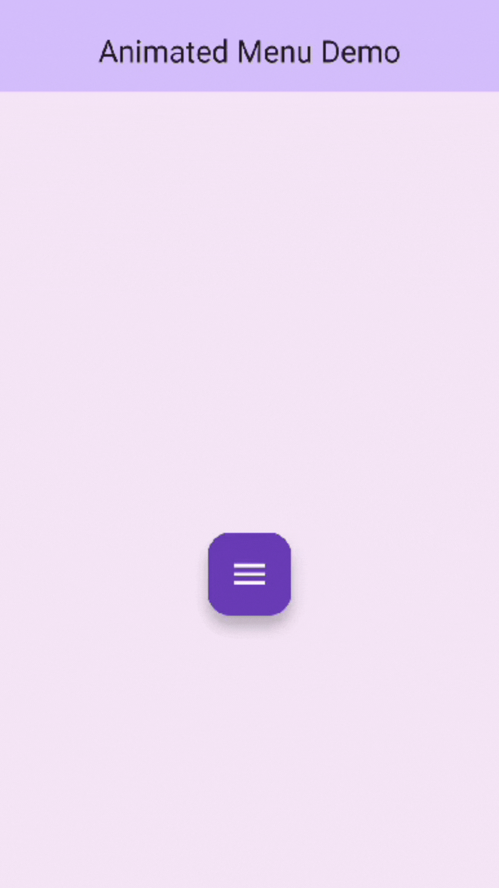

# Animated Menu Demo

A Flutter application demonstrating an elegant animated radial menu with smooth transitions and intuitive user interactions.

## Demo

<p align="center">
  
</p>

## Overview

This project implements a customizable animated menu that expands in a semi-circular arc pattern. The menu features smooth animations, tactile feedback, and a modern design following Material Design principles.

## Features

- Semi-circular expanding menu animation
- Customizable menu items with unique colors and icons
- Smooth transitions with bounce effects
- Interactive feedback with snackbar notifications
- Responsive layout adapting to different screen sizes
- Material Design 3 theming

## Technical Implementation

### Architecture

The project follows a clean architecture pattern with the following structure:

### Key Components

1. **AnimatedMenu Widget**
   - Manages menu state and animations
   - Uses `AnimationController` for smooth transitions
   - Implements `SingleTickerProviderStateMixin` for efficient animation
   ```dart
   late AnimationController _animationController;
   late Animation<double> _menuAnimation;
   ```

2. **CircularFlowDelegate**
   - Custom implementation of `FlowDelegate`
   - Handles mathematical calculations for menu item positioning
   - Uses parametric equations for circular motion:
   ```dart
   final angle = pi + (i * pi / (count - 1));
   final childX = x + (cos(angle) * radius * animation.value);
   final childY = y + (sin(angle) * radius * animation.value);
   ```

3. **Animation System**
   - Duration: 350 milliseconds
   - Curve: `Curves.easeOutBack` for natural motion
   - Reverse curve: `Curves.easeInBack` for smooth closing
   ```dart
   _menuAnimation = CurvedAnimation(
     parent: _animationController,
     curve: Curves.easeOutBack,
     reverseCurve: Curves.easeInBack,
   );
   ```

### Mathematical Concepts

1. **Semi-circular Distribution**
   - Uses π (pi) radians for 180-degree spread
   - Evenly distributes items across the arc
   - Calculates positions using trigonometric functions

2. **Animation Interpolation**
   - Linear progress (0.0 to 1.0) for menu expansion
   - Smooth easing curves for natural motion
   - Matrix4 transformations for rotation and scaling

3. **Coordinate System**
   - Origin at widget center
   - Radius-based positioning
   - Dynamic calculations based on screen size

### Performance Optimizations

1. **Efficient Rendering**
   - Uses `Flow` widget for optimal layout
   - Minimizes rebuild cycles
   - Hardware accelerated animations

2. **Memory Management**
   - Proper disposal of animation controllers
   - Efficient resource utilization
   - Optimized asset loading

## Use Cases

This animated menu component can be utilized in various applications:

1. **Social Media Apps**
   - Quick access to sharing options
   - Media upload controls
   - Reaction menus

2. **Productivity Apps**
   - Document editing controls
   - Quick action menus
   - Tool selection interfaces

3. **E-commerce Apps**
   - Product action menus
   - Sorting/filtering controls
   - Shopping cart actions

4. **Content Creation Apps**
   - Tool palettes
   - Filter controls
   - Editing options

5. **Navigation Systems**
   - Quick access menus
   - Category selection
   - Settings controls

## Customization

The menu can be customized through several parameters:
